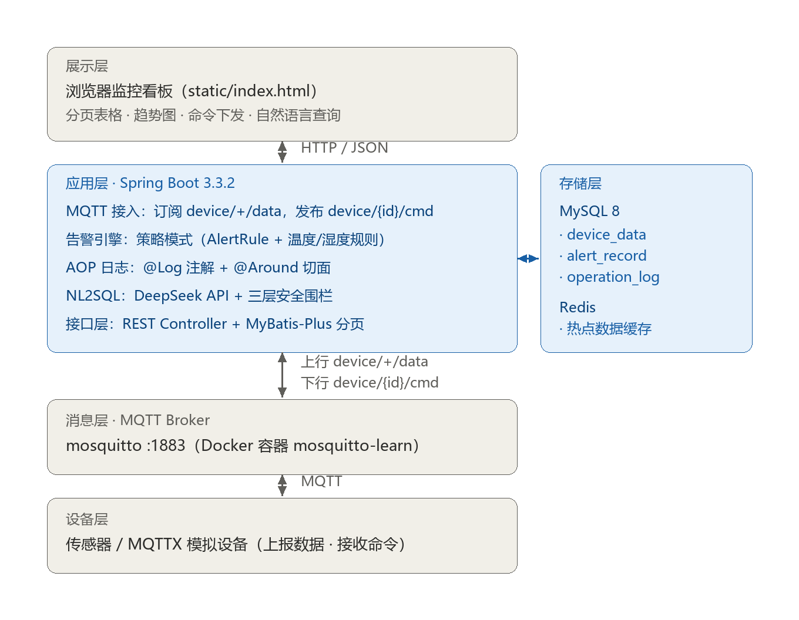

# iot-data-platform

基于 Spring Boot + MQTT 的 IoT 设备数据接入与告警平台。

设备通过 MQTT 上报环境数据，平台完成实时入库、缓存加速与阈值告警，并提供 Web 看板支持分页浏览与远程命令下发。
最特别的一点：支持**用自然语言查询数据**——中文提问，自动生成 SQL，经三层安全围栏校验后执行，
且生成的 SQL 对使用者可见（不做黑盒）。

## 架构图



<!-- 图源文件说明：
     - docs/architecture.png    当前 README 使用这个（Python/Pillow 绘制，2x 清晰度，GitHub 渲染 100% 可靠）
     - docs/architecture.svg    同内容矢量版（注：GitHub 文件页的"嵌入代码渲染"可能报 Invalid image source，
                                但 README 内以图片方式引用不受影响——若遇渲染问题，用 png 即可）
     - docs/architecture.drawio 可编辑源，能在 draw.io 里改（注意其"图形主题"会重新着色图形） -->


## 技术栈

| 技术                | 版本        | 用途                                                             |
| ----------------- | --------- | -------------------------------------------------------------- |
| JDK               | 17        | 运行环境（本地 17.0.10）                                               |
| Spring Boot       | 3.3.2     | 应用框架：内嵌 Tomcat 提供 Web 服务、统一依赖管理与自动装配                           |
| Spring MVC        | 随 Boot    | REST 接口层；由 Jackson 完成 JSON 序列化/反序列化                            |
| MyBatis-Plus      | 3.5.7     | ORM 层：表↔对象映射、自动 CRUD、LambdaQueryWrapper 条件构造、分页拦截器             |
| MySQL             | 8         | 关系型数据库，承载 `device_data` / `alert_record` / `operation_log` 三张表 |
| MySQL Connector/J | 随 Boot    | JDBC 驱动（runtime 作用域）                                           |
| Redis             | Docker 部署 | 缓存层：热点数据缓存，实现空值缓存防穿透、互斥锁防击穿                                    |
| Spring Data Redis | 随 Boot    | Redis 客户端集成（`RedisTemplate` + `@Cacheable` 声明式缓存）              |
| Eclipse Paho MQTT | 1.2.5     | MQTT 客户端：连接 Broker、订阅设备主题、收发消息                                 |
| Mosquitto         | Docker 部署 | MQTT Broker（容器 `mosquitto-learn`，端口 1883），消息中转                 |
| Spring AOP        | 随 Boot    | 横切层：自定义 `@Log` 注解 + `@Around` 切面记录操作日志                         |
| Lombok            | 1.18.34   | 编译期生成 getter/setter/toString，减少实体类样板代码                         |
| DeepSeek API      | —         | 大模型服务：NL2SQL，将自然语言问题转换为 SQL                                    |

> 版本说明：标注"随 Boot"的依赖由 Spring Boot parent POM 统一管理，因此本项目 `pom.xml` 中不写版本号；MySQL 之外的两个中间件以 Docker 容器运行，具体镜像版本可用 `docker ps` 查看后补充。

## 核心功能

1. **MQTT 双向通信**
   上行订阅 `device/+/data` 接收设备上报，解析 JSON 后入库；下行通过 `device/{id}/cmd` 下发命令。
   健壮性上做了断线自动重连、LWT 遗嘱（设备离线经 `device/{id}/status` 感知）、毒消息防护（解析失败的报文直接丢弃）。

2. **策略模式告警引擎**
   定义 `AlertRule` 接口，温度/湿度规则各自实现；`AlertService` 通过 `List<AlertRule>` 注入遍历全部规则。
   **新增规则只需添加一个实现类，既有代码零改动**（开闭原则）。

3. **AOP 操作日志**
   自定义 `@Log` 注解 + `@Around` 切面，自动记录方法名、参数、返回值与耗时到 `operation_log` 表，业务代码零侵入。

4. **Redis 缓存防护**
   `getByIdSafe` 用**空值缓存**防穿透（查不到的 ID 也缓存空值，避免无效请求打穿到数据库）；
   `getByIdWithLock` 用 `setIfAbsent` **互斥锁**防击穿（热点 key 失效瞬间只放一个请求去查库）。

5. **NL2SQL 自然语言查询**
   prompt 携带表结构 → DeepSeek 生成 SQL → **三层安全围栏**（仅允许 SELECT / 表白名单校验 / 自动补 LIMIT 100）
   → JdbcTemplate 执行；前端展示生成的 SQL，不做黑盒。

6. **分页查询与设备筛选**
   MyBatis-Plus 分页拦截器自动生成 `COUNT` 与 `LIMIT` 两条 SQL；利用条件重载实现"传了才筛选"；
   前端看板带翻页与设备 ID 筛选。

## 技术选型理由

### 为什么用 MQTT，而不是 HTTP 轮询？

设备侧是低功耗、弱网环境，HTTP 轮询需要反复建立连接，开销大且不实时。MQTT 采用长连接 + 发布/订阅模型，
报文头部最小仅 2 字节，对带宽和功耗都友好；同时天然支持一对多分发、QoS 分级（本项目命令下发用 QoS 1
保证至少送达）与遗嘱消息（设备异常离线可被感知）。这些都是 HTTP 轮询给不了的。

### 告警规则为什么用策略模式，而不是一堆 if-else？

告警规则是**持续增加**的（温度、湿度，将来还会有 PM2.5、设备离线等）。
如果全部塞进一个方法用 if-else 串联，每加一条规则都要改动同一个方法——违反开闭原则，也难以单独测试。
改用策略模式后：每条规则实现 `AlertRule` 接口，Spring 通过 `List<AlertRule>` 注入自动收集全部实现，
**新增规则只需添加一个类，既有代码一行不改**。

### 为什么用 MyBatis-Plus，而不是原生 JDBC 或 JPA？

- **原生 JDBC**：连接管理、SQL 拼接、结果集映射全部手写，样板代码多，易出错；
- **JPA**：对复杂查询与精确 SQL 控制不友好，而本项目有 NL2SQL 动态 SQL、分页、条件筛选等需求；
- **MyBatis-Plus**：单表 CRUD 零 SQL（`IService` / `BaseMapper`）；`LambdaQueryWrapper` 用方法引用书写条件
  （字段名有编译期检查，改字段名不会漏改字符串）；分页拦截器开箱即用。

### 为什么用 Redis 做缓存？

看板每 5 秒拉取一次数据，全部打到 MySQL 不划算。用 Redis 缓存热点数据以降低数据库压力；
同时借这个真实场景实践了两类缓存问题的防护方案（空值缓存防穿透、互斥锁防击穿）。

## 踩坑记录

### ① 分页查询失效：`total` 恒为 0，SQL 里没有 LIMIT

- **现象**：调用 `page()` 分页查询，返回记录数不对，`total` 一直是 0，控制台日志里的 SQL 也没有 `LIMIT`。
- **原因**：MyBatis-Plus 的分页**不是默认生效**的。必须注册 `MybatisPlusInterceptor` 并挂上
  `PaginationInnerInterceptor`，否则 `Page` 对象只是普通参数——插件不会帮你拼 `LIMIT`，也不会额外执行 `COUNT`。
- **解法**：新增 `MybatisPlusConfig` 注册拦截器并指定 `DbType.MYSQL`。配置后日志中可同时看到
  `SELECT COUNT(*)` 与带 `LIMIT ?` 两条 SQL。

### ② MQTT 消息"假入库"：日志打印了，数据库里却没有数据

- **现象**：设备上报后控制台有打印，但 `device_data` 表查不到任何新记录。
- **原因**：`messageArrived` 回调里只写了 `System.out.println`，**漏掉了入库调用**——订阅链路是通的、
  日志也有输出，看起来"收到了"，实际上一步都没做。
- **解法**：解析 JSON 后补上 `deviceDataService.save(data)`，并接上告警检查。
  教训：**日志不能当作功能验证**，必须查数据库确认最终状态。

### ③ NL2SQL 生成的 SQL 执行报错：模型输出不稳定

- **现象**：同一句问法，模型有时生成的 SQL 带中文别名（`AS 温度`）、前后夹带散文（"好的，以下是 SQL："）、
  末尾多一个分号，导致执行失败。
- **原因**：大模型输出是**概率性**的，不能假设格式永远规范。
- **解法**：在生成与执行之间做防御性清理——剥离中文别名、截取首个完整语句、去掉结尾分号；
  再经三层围栏校验后才交给 `JdbcTemplate`。
  结论：**把大模型当作"不可信输入"对待，后面必须有一层校验。**

### ④ Apifox 调接口报 415 Unsupported Media Type

- **现象**：用 Apifox 测试 `POST /device/{id}/cmd` 返回 415。
- **原因**：后端用 `@RequestBody String` 接收请求体，要求 `Content-Type: text/plain`；
  而 Apifox 的 Body 若选 JSON 格式，实际发出的是 `application/json`，Spring 找不到把 JSON 转成 String 的转换器。
- **解法**：Body 选 `raw` → 类型选 `Text`。

### ⑤ 改了环境变量却不生效

- **现象**：用 `setx` 设置了数据库密码 / API Key，重启项目仍报鉴权失败。
- **原因**：环境变量在**进程启动时**读取，已经在运行的 IDEA（及其派生的运行进程）拿到的仍是旧的环境副本。
- **解法**：**完全关闭 IDEA 再重新打开**（不是重启项目，是关掉整个 IDE）。

## 快速开始

### 环境要求

- JDK 17
- Docker（用于运行 MQTT Broker 与 Redis）
- MySQL 8

### 1. 启动依赖服务

```bash
docker start mosquitto-learn   # MQTT Broker，端口 1883
docker start redis-learn       # Redis，端口 6379
```

MySQL：启动本地 MySQL80 服务，确保存在数据库 `iot_db`（含 `device_data`、`alert_record`、`operation_log` 三张表）。

### 2. 配置环境变量

项目通过环境变量读取敏感配置，不硬编码在代码里：

| 变量名 | 用途 |
| --- | --- |
| `DB_PASSWORD` | MySQL root 密码 |
| `DEEPSEEK_API_KEY` | DeepSeek API Key（NL2SQL 功能需要） |

Windows 设置方式：

```bash
setx DB_PASSWORD "your-password"
setx DEEPSEEK_API_KEY "your-api-key"
```

> ⚠️ 设置完成后需**完全关闭并重新打开** IDEA / 终端才会生效。

### 3. 启动应用

在 IDEA 中运行 `IotDataPlatformApplication`（注意运行配置别选成同名的 JUnit 测试类）。

### 4. 访问看板

浏览器打开 <http://localhost:8080> 。

## 接口文档

在线接口文档（Apifox）：<https://s.apifox.cn/d31794b2-1f62-4f0f-93b4-85b13b60243b>
